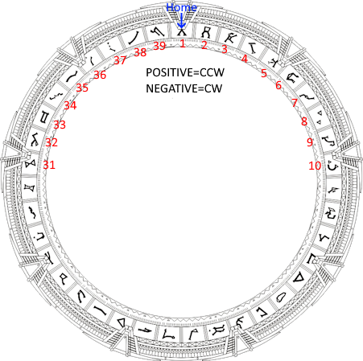

# Dial algorithm

# Ring moving

The stepper needs to move the ring at the right location based on the current ring position and which chevron to use.

## Distance

Every symbol are part of a ring, it need to calculate the minimum distance between two symbols.

Example, on a 39 symbols gate, the symbol 1 and 39 are not 38 symbols appart but are one only one symbol appart.

## Parameters

Each Stargate type have their own different symbols, including symbol count.

| Type | Symbol count | Spacing |
|---|---|---|
| Movie/SG1 | 39 | Equally spaced |
| Atlantis | 36 | Equally spaced |
| Universe | 36 | Not equally spaced |

## Calculation

To find how many step are necessary to move from one symbol to another :

### Movie/SG1/Atlantis

| Variable | Description |
|---|---|
| stepPerRot | How many step per full ring rotation |
| targetPos| Target absolute position in step |
| currPos | Current absolute position in step |
| relDistPos | Shortest distance between two symbols |
| symbolNum | Symbol number [1-39] |
| symbolCnt | Symbol count (39 or 36) |
| stepPerSymbolWidth | Step count to point to another symbol |

Positive number move the gate counter-clockwise.

Assumptions:
- Symbol number is one based.
- TargetPos 0 means the center of the symbol 1 is under the master chevron.



```C
const int32_t stepPerRot = 7000; // Abritrary value
const int32_t symbolCnt = 39;
const int32_t stepPerSymbolWidth = stepPerRot / symbolCnt;

const uint8_t symbols[] = { 12, 37, 24, 1, 32, 10, 1 };

posCurr = 0;
MoveStepperAbs(posCurr); //Move to 0.

for(int i = 0; i < sizeof(symbols)/sizeof(symbols[0]); i++)
{
    const uint8_t symbolNum = symbols[i];

    // Absolute position on the ring.
    // Notice, the algorithm is different for the universe gate. Symbols aren't equally spaced.
    const int32_t targetPos=((symbolNum-1) * stepPerSymbolWidth);

    const int32_t relDistPos = MISCFA_CircleDiff(posCurr, targetPos, stepPerRot);

    // Move the stepper by 'relDistPos' position
    MoveStepperRel(relDistPos);

    lastPosition = targetPos;
}

double MISCFA_CircleDiff(double a, double b, double rotation)
{
    const double halfRotation = rotation / 2;
    return fmod((a - b + rotation + halfRotation), rotation) - halfRotation;
}
```

## Error Handling During Dial Sequence

### Stepper Movement Timeout

Each stepper movement during the dial sequence has timeout protection:

**MoveStepperTo Function Signature**:
```cpp
bool MoveStepperTo(int32_t ticks, uint32_t timeout_ms);
```

**Parameters**:
- `ticks`: Relative movement in stepper ticks (positive or negative)
- `timeout_ms`: Maximum time to wait for movement completion (30000ms = 30 seconds)

**Returns**:
- `true`: Movement completed successfully
- `false`: Timeout reached or movement failed

### Dial Sequence Error Propagation

The dial address sequence checks each movement for success:

```cpp
// Calculate movement for symbol
const int32_t move_ticks = MISCFA_CircleDiffd32(m_current_position_ticks,
                                                 symbol_to_ticks,
                                                 new_steps_per_rotation);

// Move stepper with error checking
if (!m_sghw_hal->MoveStepperTo(move_ticks, 30000)) {
    break;  // Abort dial sequence immediately
}

// If successful, continue with chevron lock and BLE command
vTaskDelay(pdMS_TO_TICKS(500));
RingBLEClient::getI().SendLightUpSymbol(symbol);
```

### Why Error Checking Matters

**Prevents Incorrect Dialing**:
- If stepper fails to reach symbol 3, system doesn't continue to symbol 4
- Partial dial sequences are aborted rather than completed incorrectly
- User gets clear indication that dial failed

**Failure Scenarios**:
- **Stepper motor jam**: Mechanical obstruction prevents movement
- **Power issues**: Insufficient power to stepper driver
- **Timing problems**: FreeRTOS task preemption or system overload
- **Sensor errors**: Position tracking lost

**User Experience**:
- Dial command returns failure status
- Gate state returns to Idle
- User can investigate and retry
- No false "successful dial" indication

### Timeout Values

All movements during dialing use consistent timeouts:
- **Symbol alignment**: 30 seconds per symbol movement
- **Return to home**: 30 seconds for final positioning
- **Total dial time**: Up to 7 × 30 = 210 seconds maximum (3.5 minutes)
- **Typical dial time**: ~30-60 seconds for 7-symbol address

### Actual Implementation Note

The real implementation in GateControl.cpp uses angular position calculation:

```cpp
// Convert symbol to LED index, then to angle
const int32_t led_index = m_gate->SymbolToLedIndex(symbol);
const float angle = m_gate->LEDIndexToDeg(led_index);

// Convert angle to stepper ticks
const int32_t symbol_to_ticks = -(angle/360.0) * new_steps_per_rotation;

// Calculate shortest circular distance
const int32_t move_ticks = MISCFA_CircleDiffd32(m_current_position_ticks,
                                                 symbol_to_ticks,
                                                 new_steps_per_rotation);
```

This is more sophisticated than the simplified `stepPerSymbolWidth` formula shown earlier, as it accounts for LED positioning and chevron spacing.
```
