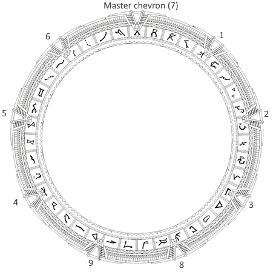
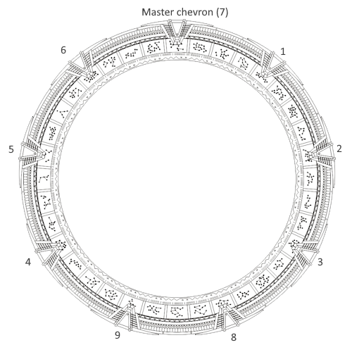
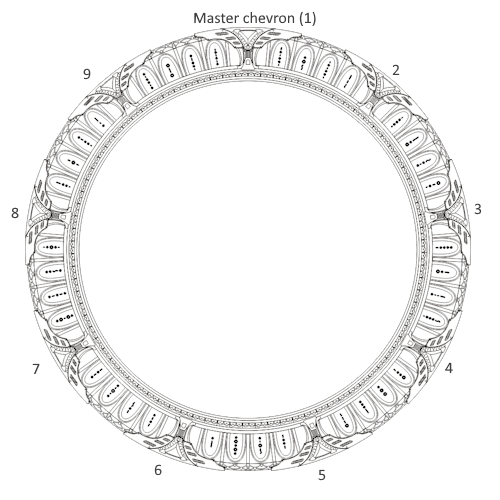

# Stargate types

There are 3 types of Stargate supported by the mainboard.

## Movie/SG1

The stargate in the Movie and SG1 are the same, except the dial sequence changed a bit and lights were added on each chevron in the SG1 version.

Source: https://stargate.fandom.com/wiki/Glyph

### Movie

In the movie, every single chevrons move to lock a symbol.
The ring spin until it get aligned with a chevron, then it move to lock it.

There are no chevron light effect in the movie, only in the serie.
But the lightning effect is there anyway on the Kristian Gate.

### SG1

To dial, every symbol will get locked using the master chevron. Then every chevron light-up in sequence, starting with the one right of the master one, going clockwise.

## Atlantis

There are no physical spinning ring, every symbol location where the ring would normally be are screen, able to display any symbol.

Source: https://stargate.fandom.com/wiki/Glyph

## Universe

Instead of having a ring, the entire gate spin above the base. All chevrons are always lit but the symbol light up on the gate when it get locked.

Source: https://stargate.fandom.com/wiki/Glyph

