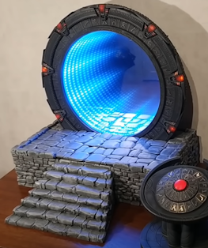
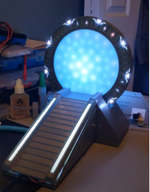

# Wormhole types

The wormhole is the part allowing the most artistic creativity.
It could be interesting to support more than one kind of wormhole.

## Software Wormhole Types vs Hardware Implementations

**Important Distinction**: This document describes physical hardware implementations, while the firmware uses software wormhole "types" to control visual effects.

### Software Types (Wormhole.hpp)

The firmware defines two software wormhole types:

```cpp
enum class EType {
    NormalSGU = 0,      // Universe Gate style wormhole effect
    NormalSG1 = 1,      // SG1/Movie Gate style wormhole effect
    Count
};
```

**Usage**: Selected via `/api/control/dialaddress` or `/api/control/manualwormhole` with `wormhole_type` parameter (0 or 1).

**Visual Effect**: Both types use the same 48-pixel LED ring with gradient brightness patterns at 25Hz refresh rate. The difference is in the animation style, not the hardware.

### 48-Pixel LED Ring Structure

The wormhole LED display (for PinkyMaxou-style implementations) uses a 48-pixel NeoPixel ring arranged in concentric circles:

**Ring Layout** (Wormhole.hpp):
```cpp
Ring0 (exterior): 17 LEDs
Ring1: 18 LEDs
Ring2: 9 LEDs
Ring3 (interior): 4 LEDs
Total: 48 pixels
```

**Technical Specifications**:
- **Refresh Rate**: 25Hz (40ms interval) - changed from 50Hz for power stability
- **Protocol**: WS2812B via RMT peripheral
- **Error Handling**: Returns false on refresh failures (typically power instability)
- **Color Scheme**: Grayscale gradient (30%-100% brightness)
- **Effect**: Semi-random ripple patterns simulating event horizon turbulence

### Hardware Implementation Categories

The following sections describe different physical wormhole construction methods. The software wormhole types (NormalSGU, NormalSG1) work with any of these hardware implementations.

## Kristian's wormhole

The wormhole is the one used by 'Build the Stargate' project at the moment.
It use two semi-transparent mirrors to create an infinite tunnel effect.



## Kristian's wormhole #2 (retro-projection)

It uses a retro-projector and electro-chrome film.

--ADD AN IMAGE HERE--

## PinkyMaxou's wormhole

This one used an home-made 'screen' made of 48 neopixels LEDs.
It is not yet used on the Kristian project, but it could be adapted.

It create semi-random pattern of lights to reproduce the ripple effect.



## Tazou's wormhole

There are no working prototype yet. But it will likely combine rear leds, like on the PinkyMaxou's wormhole with mica powder and a pump.
It will likely require more than just neopixel to works.

---

## Technical Implementation Notes

### Recent Changes (2026-01)

**Refresh Rate Reduced**: The wormhole LED refresh rate was changed from 50Hz (20ms) to 25Hz (40ms) in recent commits for improved stability:

```cpp
// Wormhole.cpp line 103
vTaskDelay(pdMS_TO_TICKS(40));  // Changed from 20ms to 40ms
```

**Reason**: The slower refresh rate reduces stress on:
- Power supply (48 LEDs at full brightness)
- RMT peripheral (512-symbol buffer prevents underruns)
- FreeRTOS scheduler (allows other tasks more CPU time)

**Error Handling**: `RunTicks()` now returns `false` if `RefreshWHPixels()` fails, allowing graceful degradation:
```cpp
if (!m_hal->RefreshWHPixels()) {
    ESP_LOGW(TAG, "Error during refresh, may be caused by power instability");
    return false;
}
```

This typically occurs with:
- Insufficient power supply current
- Loose power connections
- Voltage drop under load

### RMT Configuration for LED Strips

The RMT peripheral driving the WS2812B LEDs uses:
- **Memory Block Symbols**: 512 (increased from 128)
- **Clock Resolution**: 10MHz
- **DMA**: Disabled (mutex-based protection instead)

See [architecture.md](architecture.md) for complete RMT configuration details.

