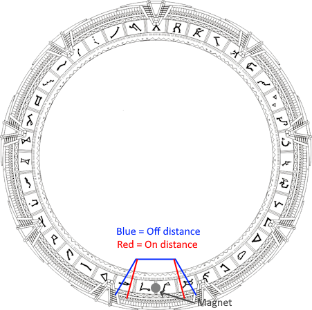

# Homing algorithm

The homing algorithm should run every time the gate power up.
It's also possible to manually run it.

## Hall sensor

Also hall sensor have an hysterisis, meaning the position to activate it and deactivate it are not the same.

There could be several degrees of hysterisis, depending on how it is mechanically assembled or what sensor is used.

This diagram represent an exagerated version of the phenomena.

## Light sensor

The ring contains an hidden hole with a led on one side and a sensor on the other side of the hole.
The hysterisis is likely very low. But the algorithm remains the same as for the Hall sensor.

# Homing procedure

If the ring is already in a position were the home sensor is ON (magnet near the sensor), it doesn't mean the homing is done correctly.

The stepper while unpowered could move the ring slightly out of alignment.

But the good part is that it makes the homing significantly faster, it doesn't need the ring to do an entire rotation.

- Spin the ring until the home sensor is ON. Consider it's the temporary 0 position.
- Continue moving in the same direction until the home sensor is OFF.
- Move in the other direction until the home sensor is ON. (step count should decrement)
- Check how many step were done, divide the value by two to find the middle.
- Move the gate by the number of step the previous part of the algorithm returned to center it.

If the home sensor sensor is off at the start of the process, it will takes more time because it may needs to do an entire rotation to find the home point.
