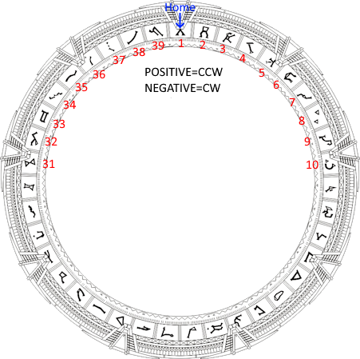

# Spinning ring algorithm

The stepper needs to move the ring at the right location based on the current ring position and which chevron to use.

## Distance

There are two distance to calculate, because the ring can spin clockwise or counter-clockwise to reach the right symbol.
We use the shortest path and spin the ring accordingly.
But it's not the only way to do it, we can imagine an algorithm defining a minimum spin distance just for dramatic purpose.

## Parameters

Each Stargate type have their own different symbols, including symbol count.

| Type | Symbol count | Spacing |
|---|---|---|
| Movie/SG1 | 39 | Equally spaced |
| Atlantis | 36 | Equally spaced |
| Universe | 36 | Not equally spaced |

## Calculation

To find how many step are necessary to move from one symbol to another :

### Movie/SG1/Atlantis

| Variable | Description |
|---|---|
| stepPerRot | How many step per full ring rotation |
| targetPos| Target absolute position in step |
| currPos | Current absolute position in step |
| distPos1 | First path distance |
| distPos2 | Second path distance |
| distPos3 | 3th path distance |
| symbolNum | Symbol number [1-39] |
| symbolCnt | Symbol count (39 or 36) |
| stepPerSymbolWidth | Step count to point to another symbol |

Positive number move the gate counter-clockwise.

Assumptions:
- Symbol number is one based.
- TargetPos 0 means the center of the symbol 1 is under the master chevron.



```C
const int32_t stepPerRot = 7000; // Abritrary value
const int32_t symbolCnt = 39;
const int32_t stepPerSymbolWidth = stepPerRot / symbolCnt;

const uint8_t symbols[] = { 12, 37, 24, 1, 32, 10, 1 };

posCurr = 0;
MoveStepperAbs(posCurr); //Move to 0.

for(int i = 0; i < sizeof(symbols)/sizeof(symbols[0]); i++)
{
    const uint8_t symbolNum = symbols[i];

    // Absolute position on the ring.
    const int32_t targetPos=((symbolNum-1) * stepPerSymbolWidth);

    const int32_t distpos1=(targetPos-posCurr);
    const int32_t distpos2=(-1 * (posCurr+(stepPerRot - targetPos)));
    const int32_t distpos3=(targetPos+(stepPerRot - posCurr));

    int32_t relDistPos = distpos1;
    if ( abs(distpos2) < abs(relDistPos) ) {
        relDistPos = distpos2
    }
    if ( abs(distpos3) < abs(relDistPos) ) {
        relDistPos = distpos3
    }

    // Move the stepper by 'relDistPos' position
    MoveStepperRel(relDistPos);

    posCurr = targetPos;
}
```

Example:

stepPerSymbolWidth = 179.48

| From sym | Target sym | D1 | D2 | D3 |
|---|---|---|---|---|
| 2 (179.48) | 4 (538.44) | 358.96 | -6641.04 | 7538.44 |
| 5 (717.92) | 3 (358.96) | -358.96 | -7358.96 | 6641.04 |
| 4 (538.44) | 38 (6640.76) | 6102.32 | -897.68 | 13102.32 |
| 38 (6640.76) | 4 (538.44) | -6102.32 | -13102.32 | 897.68 |


