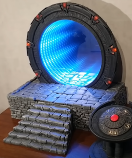
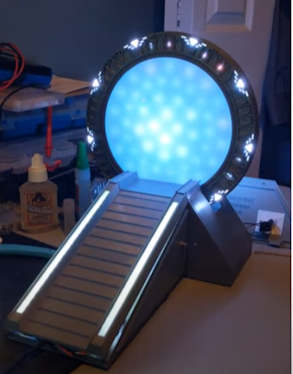

# Wormhole types

The wormhole is the part allowing the most artistic creativity.
It could be interesting to support more than one kind of wormhole.

## Kristian's wormhole

The wormhole is the one used by 'Build the Stargate' project at the moment.
It use two semi-transparent mirrors to create an infinite tunnel effect.

## Kristian's wormhole #2 (retro-projection)

It uses a retro-projector and electro-chrome film.

--ADD AN IMAGE HERE--

## PinkyMaxou's wormhole

This one used an home-made 'screen' made of 48 neopixels LEDs.
It is not yet used on the Kristian project, but it could be adapted.

It create semi-random pattern of lights to reproduce the ripple effect.

## Tazou's wormhole

There are no working prototype yet. But it will likely combine rear leds, like on the PinkyMaxou's wormhole with mica powder and a pump.
It will likely require more than just neopixel to works.

